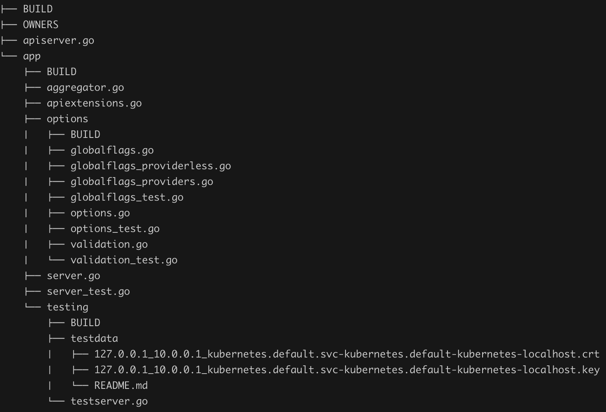

[toc]

## k8s架构

k8s系统架构遵循C/S架构，分为Master和Node两部分，Master作为服务端（可以有多个来实现高可用），Node作为客户端。

### 1.1 Master和Node节点

Master负责任务：

- 管理所有节点（node）
- 调度Pod到哪些节点上运行，
- 负责控制集群运行过程中的状态

Node负责任务：

- 管理容器
- 监控/上报Pod的状态

#### Master节点组件

- kube-apiserver

  集群的HTTP REST API接口，是集群控制的入口

- kube-scheduler

  集群中Pod的调度服务

- Kube-controller-manager

  集群中所有资源对象的控制中心

#### Node节点组件

- kubelet

  负责节点上容器的创建、删除、启停等任务，于Master节点通信

- kube-proxy

  负责kubernetes服务的通信以及负载均衡

- container

  负责容器的基础管理，接收kubelet组件

### 1.3 组件介绍

#### kube-apiserver

负责将k8的**资源组/资源版本/资源**以RESTful风格的形式暴露并提供服务，集群所有的组件都通过apiserver操作资源对象，也是作为唯一与Etcd进行交互的组件

#### etcd

一个分布式键值存储，具有强一致性，存储了k8集群的状态和元数据，包括k8资源对象信息，集群节点信息。这也就是

#### kubectl

作为k8官方提供的命令行工具(CLI)，用户可以通过kubectl用命令行的方式与apiserver交互，通信协议**HTTP/JSON**

#### client-go

同样是与apiserver交互，与kubectl命令行交互不同，client是以编程方式进行交互，一个从k8代码里抽出来的包，作为官方提供的Go客户端，这也是k8其他组件与apiserver通信的实现方式。

作为k8开发者，这个包得熟练使用并掌握

#### Kube-controller-manager

负责管理k8集群的节点、Pod副本、服务、端点、命名空间（namespace）、服务账号（ServiceAccount）、资源定额（ResourceQuota）等，基于etcd的分布式锁来实现高可用

Controller-manager确保kubernetes系统实际转台收敛到所需状态，默认有一些控制器，DeploymentControllers控制器，它们与apiserver通信监听对应资源状态，发生变化时会去尝试修复。

#### kube-scheduler

称为调度器，是Kubernetes集群的默认调度器，负责调度Pod到合适的节点上运行，每次只调度一个pod，调度算法分为两种：预选调度算法和优选调度算法。

#### kubelet

管理节点，运行在每个Kubernetes节点上。kubelet组件用来接收、处理、上报kube-apiserver组件下发的任务。当它启动时会向kube-apiserver注册节点自身信息。它主要负责所在节点上的Pod资源对象的管理，包括创建、修改、监控、删除、驱逐及Pod生命周期管理等。

##### kubelet的三种开放接口

- Container Runtime Interface：简称CRI（容器运行时接口），提供容器运行时通用插件接口服务。将kubelet组件和容器运行时（docker、rkt之类）解耦，将Pod级别的内部接口拆分成面向sandbox和Container的gRPC接口，镜像管理和容器管理拆分给不同服务
- Container Network Interface：简称CNI（容器网络接口），提供网络通用插件接口服务，CNI定义了Kubernetes网络插件的基础，容器创建时通过CNI插件配置网络
- 简称CSI（容器存储接口），提供存储通用插件接口服务。定义了容器存储卷标准规范，容器通过CSI插件配置存储卷

#### kube-proxy

运行在每个Kubernetes节点上，监控kube-apiserver的服务（service）和端点（endpoints）资源变化，并通过iptables/ipvs等配置负载均衡器，为一组Pod提供统一的TCP/UDP流量转发和负载均衡

kube-proxy只代理发送给k8s服务和其Pod的请求

### 1.4 k8s project layout（项目代码结构）

社区提出了一个Standard Go Project Layout方案，以及对Go预言项目目录结构进行划分。

| 标题1        | 标题2                                                    |
| ------------ | -------------------------------------------------------- |
| cmd          | 存放可执行文件的入口代码，每个可执行文件都有一个main函数 |
| pkg          | 存放核心代码，可悲项目内部或外部直接引用                 |
| vendor       | 存放依赖的库代码                                         |
| api          | 存放OpenAPI/Swagger的spec文件，包括JSON、Protocol        |
| build        | 存放于构建相关的脚本                                     |
| test         | 测试相关                                                 |
| docs         | 文档相关                                                 |
| hack         | 存放构建、测试相关加奥本                                 |
| third_party  | 第三方工具、代码或其他组件                               |
| plugin       | 放k8s插件代码，例如认证、授权等相关插件                  |
| translations | 存放翻译文件                                             |

系统组件较多，各组件的代码入口main结构设计风格高度一致

apiserver启动流程

