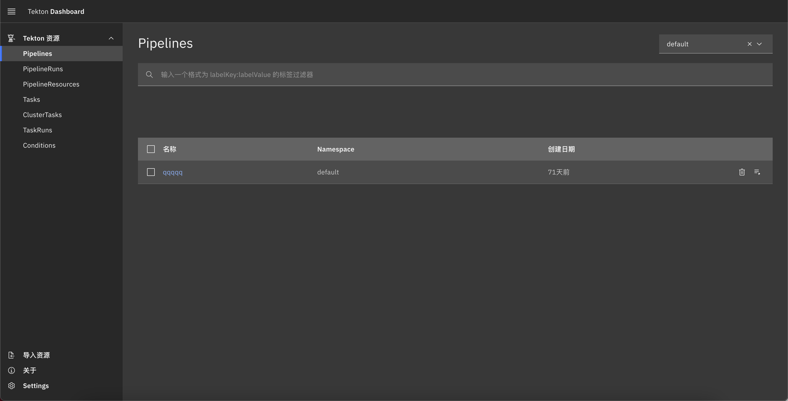
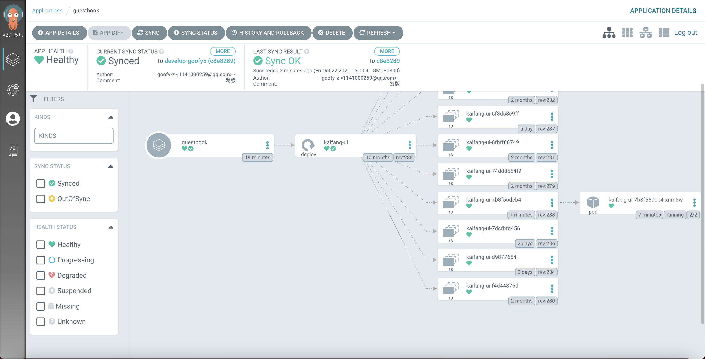

[toc]

## 什么是tekton

Tekton 是一个功能强大且灵活的Kubernetes 原生开源框架，用于云上持续集成和交付（CI/CD）系统，通过Operator的方式集成到k8集群中，并以容器作为驱动，完成流水线模版定义的任务，社区也提供了很多任务模版来方便使用。

## 安装tekton

```shell
kubectl apply -f https://storage.googleapis.com/tekton-releases/pipeline/previous/v0.26.0/release.yaml
```

总共部署了两个`deployment`，默认是在namespace`tekton-pipelines`。

```shell
kubectl get deploy -n tekton-pipelines 
NAME                          READY   UP-TO-DATE   AVAILABLE   AGE
tekton-dashboard              1/1     1            1           88d // 这个是dashboard
tekton-pipelines-controller   1/1     1            1           69d
tekton-pipelines-webhook      1/1     1            1           88d
```

### 安装Dashboard

```shell
kubectl apply --filename https://storage.googleapis.com/tekton-releases/dashboard/latest/tekton-dashboard-release.yaml
```

默认dashboard服务是只能通过ClusterIP访问，我们可以通过修改它的svc的类型为NodePort或者直接在当前节点使用代理访问`kubectl port-forward svc/tekton-dashboard -n tekton-pipelines 37033:9097`



### Tekton提供的CRD

- Task： 任务模版，你可以在里面定义相应的steps来表示需要执行的步骤，每个step代表一个pod。
- TaskRun：任务模版的执行实例，通过传入任务模版定义的参数来创建。
- Pipeline：流水线模版，包含一系列任务并且定义各个任务之间的先后顺序。
- PipelineRun：流水线模版实例，关联到流水线并传入所有的任务参数来执行

## 安装argocd

### 创建argocd

```shell
kubectl create namespace argocd
kubectl apply -n argocd -f https://raw.githubusercontent.com/argoproj/argo-cd/stable/manifests/install.yaml
```

执行完之后我们能看到在`argocd` Namespace下创建了4个deployment

```shell
kubectl get deployment -n argocd
NAME                 READY   UP-TO-DATE   AVAILABLE   AGE
argocd-dex-server    1/1     1            1           14m
argocd-redis         1/1     1            1           14m
argocd-repo-server   1/1     1            1           14m
argocd-server        1/1     1            1           14m
```

- argocd-dex-server: 与SSO有关
- argocd-redis：这就是redis服务
- argocd-repo-server：维护保存应用程序清单的Git存储库的本地缓存，并负责生成和返回Kubernetes清单

- argocd-server: API服务器是gRPC/REST服务器，它公开Web UI、CLI和CI/CD系统所使用的API。

此外还有一个`sts`资源

```shell
kubectl get sts -n argocd 
NAME                            READY   AGE
argocd-application-controller   1/1     14m
```

- argocd-application-controller: 一个k8s控制器，监控运行的应用，并将当前的活动状态与所需的目标状态(在repo中指定)进行比较。

然后是创建5个`svc`

```shell
kubectl get svc -n argocd 
NAME                    TYPE        CLUSTER-IP       EXTERNAL-IP             
argocd-dex-server       ClusterIP   172.31.104.178   <none>      
argocd-metrics          ClusterIP   172.31.130.239   <none>      
argocd-redis            ClusterIP   172.31.81.161    <none>       
argocd-repo-server      ClusterIP   172.31.61.26     <none>        
argocd-server           NodePort    172.31.93.217    <none>      
argocd-server-metrics   ClusterIP   172.31.154.210   <none>       
```

注意：`argocd-server`被我修改成了`NodePort`的形式便于我通过UI界面访问，暴露了http和https的端口

### 安装客户端

```
curl -sSL -o /usr/local/bin/argocd https://github.com/argoproj/argo-cd/releases/latest/download/argocd-linux-amd64
chmod +x /usr/local/bin/argocd
```

### 连接argocd server

访问`argocd-server`有两种方式，一个是通过UI来登录，一种通过客户端，但首先还是得获取登录的密码，账号是`admin`.

```shell
kubectl -n argocd get secret argocd-initial-admin-secret -o jsonpath="{.data.password}" | base64 -d
VntlGg8mCy1chAzE // 这就是密码
```

使用客户端登录：

```shell
argocd login 172.31.93.217 // 在集群内部可以用ClusterIP
WARNING: server certificate had error: x509: cannot validate certificate for 172.31.93.217 because it doesn't contain any IP SANs. Proceed insecurely (y/n)? y
Username: admin
Password: 
```

### 创建App

1. 配置仓库（repo）

   argocd作为GitOps解决方案，本身依赖一个存储应用程序声明文件的Git仓库，同步集群中相关资源状态为Git仓库中声明文件的期望状态。

   创建一个repo对象需要能够真正能访问该repo，并且具有权限，因为argocd会主动去访问该git的API从而获取对应的目录结构、分支等信息，我们通过创建带ssh私钥的`Secret`的来或得访问权限。

   ```shell
   argocd repo add git@github.com:DaoCloud/Atr-api.git --ssh-private-key-path /root/.ssh/id_rsa
   ```

   查看repo是否创建成功

   ```shell
   argocd repo list
   TYPE  NAME  REPO                                 INSECURE  OCI    LFS    CREDS  STATUS      MESSAGE
   git         git@github.com:DaoCloud/Atr-api.git  false     false  false  false  Successful
   ```

2. 创建APP

   还是通过客户端的方式来创建

   ```shell
   argocd app create guestbook --repo git_url --path deploy --dest-server https://kubernetes.default.svc --dest-namespace default --revision branch
   ```

   参数解释：

   - create后的第一个位置参数代表app的名称
   - repo：该应用绑定的配置仓库
   - path：监听的声明文件在配置仓库的路径
   - dest-server：部署的目标集群，`https://kubernetes.default.svc`
   - dest-namespace：部署的目标集群NameSpace

3. 同步app到集群

   ```shell
   argocd app sync guestbook
   TIMESTAMP                  GROUP        KIND   NAMESPACE                   NAME    STATUS   HEALTH        HOOK  MESSAGE
   2021-10-22T18:20:35+08:00   apps  Deployment  default            kaifang-ui    Synced  Healthy              
   2021-10-22T18:20:35+08:00   apps  Deployment  default            kaifang-ui    Synced  Healthy              deployment.apps/kaifang-ui unchanged
   
   Name:               guestbook
   Project:            default
   Server:             https://kubernetes.default.svc
   Namespace:          xxxxx
   URL:                https://172.31.93.217/applications/guestbook
   Repo:               xxxx.git
   Target:             develop-goofy5
   Path:               deploy
   SyncWindow:         Sync Allowed
   Sync Policy:        <none>
   Sync Status:        Synced to develop-goofy5 (c8e8289)
   Health Status:      Healthy
   
   Operation:          Sync
   Sync Revision:      c8e828979745b3589515196ec469bdbca271da29
   Phase:              Succeeded
   Start:              2021-10-22 18:20:34 +0800 CST
   Finished:           2021-10-22 18:20:35 +0800 CST
   Duration:           1s
   Message:            successfully synced (all tasks run)
   
   GROUP  KIND        NAMESPACE    NAME        STATUS  HEALTH   HOOK  MESSAGE
   apps   Deployment  kongtianbei  kaifang-ui  Synced  Healthy        deployment.apps/kaifang-ui unchanged
   ```

### 集群中查看效果



### 添加集群

argocd添加集群需要在部署了`argocd`的集群能够访问到待添加集群，可以在kubeconfig文件中添加目标集群的集群证书和用户证书等信息，下面命令实际就是去创建一套该sa并绑定到admin的ClusterRole角色

```
argocd cluster add zone_41 // zone_41 位目标集群的context
```

## 开始构建CI/CD流水线

由于一些任务依赖与Argocd创建的应用的配置，需要提前建立好Argocd的应用，具体方式参考上面。

流水线共有以下几个任务：

- Git Clone：clone仓库，提供工作区用于镜像构建。
- Build Image：借助容器中构建镜像技术，如kaniko来构建镜像，并push到指定仓库。
- Change Config：修改应用的部署声明文件，这里替换deployment声明文件的Image为新的Image。
- Git Push Config：提交应用的声明文件到argocd监听的git仓库。
- Deploy：主动触发Argocd的同步，从而实现镜像替换的部署。

### 创建Task

接下来会介绍对每一个任务的功能实现细节，在此之前还需要介绍一个tekton的资源对象`workspaces`，在CI过程中多个任务share同一个工作区，所以依赖一个能够在多个任务（也就是pod）间共享的存储，而`workspaces`资源对象正是为每一个Task抽象出一个文件系统，但需要在`TaskRun`中指定其实现方式：包括`Configmap`、`Secret`、`PVC`；如果不需要在多个任务间共享则可以使用`pv`、`emptyDir`的形式。

#### Git Clone

这一步是将目标代码仓库代码拉取到工作区，共包含下述几个任务参数：

- CLONE_URL： git仓库地址
- SUBDIR：git clone之后的项目名
- BRANCH：git clone的分支

下面是从tekton hub上找到的git-cli模版，做了一些修改：[git-cli.yaml](./yaml/git-cli.yaml)

同时依赖至少两个`workspaces`：

- source：用于存放代码的工作区，使用pvc实现存储。
- ssh-directory：一个保存了`ssh私钥`和`known_hosts`的`Secret`，使其能够有目标git仓库的权限。

#### Build Image

任务的主要功能是构建镜像并push到指定的镜像仓库，任务参数如下：

- IMAGE：构建之后的目标镜像
- CONTEXT：工作区的目录，这里对应上一步的`SUBDIR`
- DOCKERFILE: Dockerfile文件路径

下面同样是从tekton hub上找到的git-cli模版，做了一些修改：[kaniko.yaml](./yaml/kaniko.yaml)

同时依赖至少两个`workspaces`：

- source：用于存放代码的工作区，使用pvc实现存储。
- dockerconfig：一个保存了docker的auth配置信息的`configmap`，使其能够有push镜像仓库的权限。

#### Change Config

在镜像build完成且推送镜像仓库成功后，需要取更新应用声明文件里的镜像地址，目前是借助`yq`工具修改指定名称文件的`deployment`资源定义文件里镜像，需要自己写`yq`的表达式。

- CONTEXT：工作区需要更改的git项目目录，这个git必须是argocd监听的项目
- CONFIG_FILE：deployment资源定义文件名，必须是位于argocd设置的`path`下
- EXPRESSION：yq表达式，例如在`pipelineRun`传入`(.spec.template.spec.containers.[]|select(.name == \"api\").image)|=`，这个表达式的意思就是找到名称为`api`容器并将image字段替换为`=`后的新镜像，在后面定义`pipeline`时，我们时直接将`pipelineRun`传入的`IMAGE`和`EXPRESSION`参数组合成：`$(params.EXPRESSION)\"$(params.IMAGE)\"`传入到该任务，这样完整的yq表达式为`(.spec.template.spec.containers.[]|select(.name == \"api\").image)|="新构建的镜像"`

只依赖`source`这一个workspace。

#### Git Push Config

这一步就是提交应用声明文件的更改。

- SUBDIR：argocd监听git项目目录名
- BRANCH：argocd监听git项目的分支

同样是从tekton hub上找到的argocd部署任务模版：[git-push-config.yaml](git-push-config.yaml)

和`Git Clone`一样依赖两个`workspaces`：`srouce`、`ssh-directory`

#### Deploy

借助argocd的客户端来执行同步过程，

- APP_NAME：Argocd的APP名称
- BRANCH：Argocd监听项目的分支

同样是从tekton hub上找到的argocd部署任务模版：[deploy-argocd.yaml](deploy-argocd.yaml)

在这个任务中需要制定argocd-server的服务地址，还需要能够操作argocd的用户名和密码，这些可以不作为变量，直接hardcode在模版中

### 创建Pipeline

[ci-cd-pipeline.yaml](./yaml/ci-cd-pipeline.yaml)

### 创建TaskRun（示例）

[run.yaml](./yaml/run.yaml)

